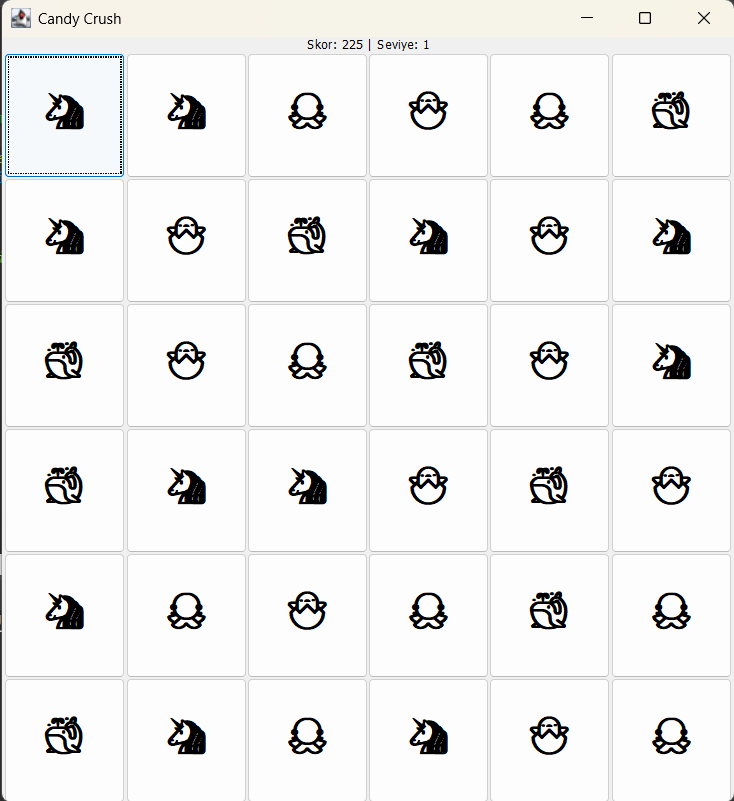
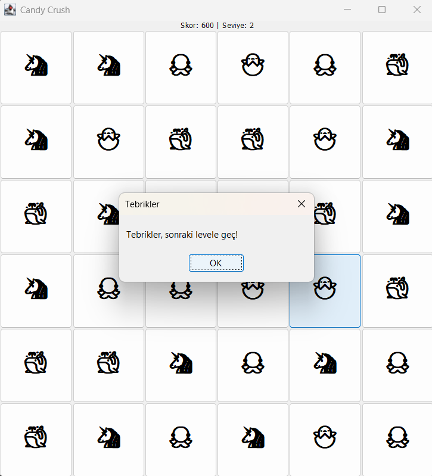
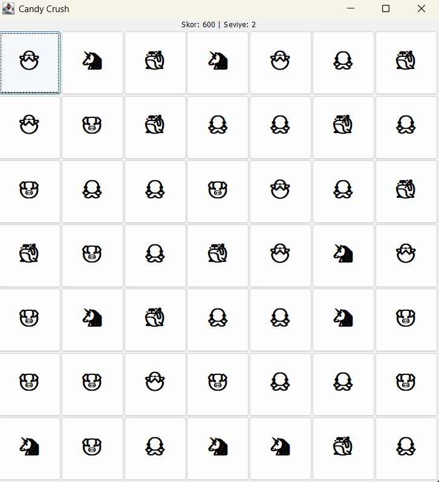

# 🍬 Candy Crush – Java Swing Match-3 Game

Java Swing kullanılarak geliştirilmiş, Candy Crush tarzı eşleştirme oyunu.

> **Not:** Bu proje, OOP, algoritma tasarımı ve GUI geliştirme yeteneklerimi göstermek için geliştirilmiştir.

---

## 📝 Proje Hakkında

Popüler **Candy Crush** oyununun Java ile geliştirilmiş masaüstü versiyonu. Oyuncular emoji şekerleri eşleştirerek puan toplar ve 5 seviyeyi tamamlar.

**Proje Bilgileri:**
- **Geliştirme Süresi:** 2 hafta
- **Teknolojiler:** Java, Swing, OOP
- **Kod Satırı:** ~300 satır
- **Proje Türü:** Eğitim & Staj Portföy Projesi

---

## ✨ Özellikler

- 🎮 5 farklı zorluk seviyesi
- 📐 Dinamik grid boyutu (6×6 → 10×10)
- 🎨 9 farklı emoji şeker (🐣 🐳 🦄 🐙 🐷 🐶 🐻 🐸 🐔)
- 💯 Skor sistemi (eşleşme başına 75 puan)
- 🔄 Zincirleme eşleşme (cascade matching)
- ⬇️ Otomatik şeker düşme ve yenileme
- 🏆 Seviye geçiş sistemi (500 puan/seviye)

---

## 🎮 Nasıl Oynanır?

1. Yan yana iki şekeri seç ve yer değiştir
2. 3+ aynı şeker yan yana gelirse patlar
3. Üstten yeni şekerler düşer
4. 500 puana ulaşınca seviye atla
5. 5. seviyeyi tamamla ve kazan!

---

## 🏗️ Teknik Detaylar

### Mimari Tasarım
```
├── Model: BaseCandy.java (veri modeli)
├── View: Candy.java, GameUI.java (UI)
└── Controller: CandyLogic.java, GameBoard.java (oyun mantığı)
```

**OOP Prensipleri:**
- Encapsulation (private fields + getters/setters)
- Inheritance (BaseCandy → Candy)
- Separation of Concerns

### Ana Algoritmalar

**1. Eşleşme Tespiti (O(n²)):**
```java
// Yatay ve dikey tarama ile 3+ eşleşmeleri bul
for (int row = 0; row < grid.length; row++) {
    for (int col = 0; col < grid[row].length - 2; col++) {
        if (grid[row][col] == grid[row][col+1] == grid[row][col+2]) {
            markForPop(row, col);
        }
    }
}
```

**2. Zincirleme Kontrol:**
```java
do {
    refillBoard();
    refreshUI();
} while (findAndPopMatches());
```

**3. Geçersiz Hamle Kontrolü:**
```java
swapCandies(candy1, candy2);
if (!hasMatch()) {
    swapCandies(candy1, candy2); // Geri al
}
```

---

## 📁 Dosya Yapısı

| Dosya | Satır | Sorumluluk |
|-------|-------|-----------|
| `CandyCrush.java` | ~15 | Main entry point |
| `GameUI.java` | ~70 | Pencere, skor, seviye |
| `GameBoard.java` | ~90 | Grid, kullanıcı etkileşimi |
| `CandyLogic.java` | ~80 | Eşleşme algoritması |
| `Candy.java` | ~30 | Şeker UI bileşeni |
| `BaseCandy.java` | ~15 | Veri modeli |

---

## 🚀 Kurulum ve Çalıştırma

### Gereksinimler
- Java JDK 8+
- IDE (IntelliJ IDEA, Eclipse) veya Terminal

### Hızlı Başlangıç
```bash
# Klonla
git clone https://github.com/Onurra/Candy-Crush-Java.git
cd Candy-Crush-Java

# Derle ve çalıştır
javac game10/*.java
java game10.CandyCrush
```

### IDE ile
1. Projeyi aç
2. `CandyCrush.java` → Run

---

## 🎓 Kazanılan Yetenekler

**Java & OOP:**
- Class inheritance, encapsulation, package organization

**GUI Development:**
- Swing components, Layout managers, Event handling, Thread-safe UI

**Algoritma:**
- 2D array manipulation, Pattern matching, State management

**Software Engineering:**
- Clean code, Version control (Git), Documentation

---

## 💡 Karşılaşılan Zorluklar

**1. Zincirleme Eşleşme**
- **Problem:** Düşen şekerlerde yeni eşleşmeler kontrol edilmiyordu
- **Çözüm:** Do-while loop ile eşleşme kalmayıncaya kadar kontrol

**2. Geçersiz Hamle**
- **Problem:** Eşleşme olmayan swap'lar geri alınmıyordu
- **Çözüm:** Match kontrolü sonrası reverse swap

**3. UI Thread Safety**
- **Problem:** UI güncellemesi senkronizasyon sorunu
- **Çözüm:** SwingUtilities.invokeLater() kullanımı

---

## 🔮 Gelecek Geliştirmeler

- [ ] Animasyonlu şeker düşme
- [ ] Ses efektleri
- [ ] Özel güç şekerleri (bomba, çizgili şeker)
- [ ] Hamle sayısı limiti
- [ ] High score sistemi
- [ ] JUnit test case'leri

---

## 📸 Demo

### Oyun Oynanırken


### Seviye Atlama


### Yeni Seviye


---

## 👨‍💻 Geliştirici

**Onur İLGIN-Bilgisayar Mühendisliği Öğrencisi**

---

## 📜 Lisans

MIT License - Eğitim amaçlı kullanım serbesttir.

---

**⭐ Projeyi beğendiyseniz star vermeyi unutmayın!**
